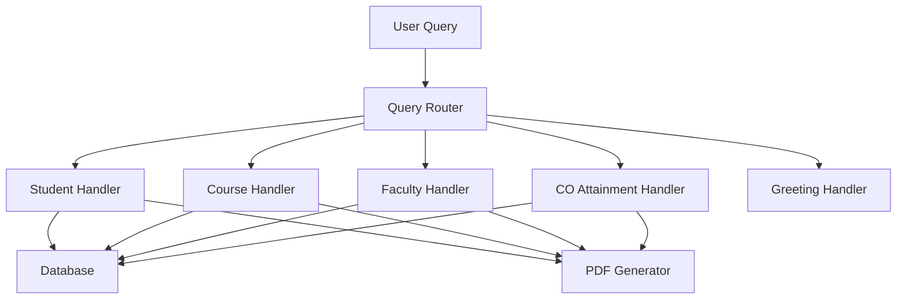

# Handlers Documentation

This directory contains detailed documentation for each handler in the ObeAI™ system. Each handler is responsible for processing specific types of queries and managing related functionality.

## Available Handlers

1. [Query Router](./query_router.md) - Central routing system for directing queries
2. [Student Handler](./student_handler.md) - Student information management
3. [Course Handler](./course_handler.md) - Course-related query processing
4. [Faculty Handler](./faculty_handler.md) - Faculty information management
5. [CO Attainment Handler](./co_attainment_handler.md) - Course Outcome analysis
6. [Greeting Handler](./greeting_handler.md) - Basic conversation management

## Common Features

All handlers share some common characteristics:

### Error Handling
- Database connection error management
- Invalid input handling
- Exception logging and tracking

### PDF Generation
- Large result set handling
- Customized report generation
- Visualization integration

### Logging System
- Debug information tracking
- Error logging
- Query processing steps

### Pattern Matching
- Regular expression-based entity extraction
- Intent classification
- Query validation

### Database Integration
- Connection pooling
- Prepared statements
- Result formatting

## Handler Interaction Flow



## Best Practices

When modifying or extending handlers:

1. Always maintain error handling patterns
2. Follow the established logging structure
3. Use prepared statements for database queries
4. Document any new methods or features
5. Update unit tests for new functionality

## Directory Structure

```
handlers/
├── __init__.py
├── query_router.py
├── student_handler.py
├── course_handler.py
├── faculty_handler.py
├── co_attainment_handler.py
└── greeting_handler.py
``` 